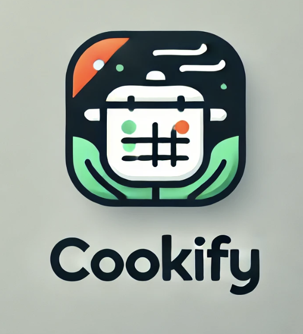

### **Sujet : Cookify - Gestionnaire de Recettes Culinaires avec Planificateur de Menus**  

### Plan du cours général

[plan du cours](../01_ORGA/00_plan.md)

## Sujet

---

#### **Contexte**  
Vous êtes chargé de développer une application permettant de gérer des recettes culinaires pour aider les utilisateurs à organiser leurs repas. L'application doit offrir une interface intuitive pour créer, consulter, modifier et supprimer des recettes, et permettre aux utilisateurs de planifier leurs menus hebdomadaires à partir des recettes enregistrées.

---

#### **Objectifs pédagogiques**  
1. **Maîtriser les concepts de base d'une application en React** (composants, gestion de l'état, props).  
2. **Interagir avec une API RESTful** pour réaliser des opérations CRUD.  
3. **Intégrer une spécificité métier** avec la planification des menus.  
4. **Appliquer les bonnes pratiques de développement** : séparation logique des composants, documentation, tests basiques, et déploiement.  

---

### **Fonctionnalités attendues**  

#### **1. Gestion des recettes (CRUD)**  
- **Créer une recette** : Les utilisateurs peuvent ajouter une recette avec les champs suivants :
  - Nom de la recette (ex. "Tarte aux pommes").
  - Liste des ingrédients (quantités et noms, ex. "200g de farine, 3 pommes").
  - Instructions (texte détaillé).  
- **Consulter une recette** : Afficher les détails d'une recette sélectionnée.  
- **Modifier une recette** : Modifier les champs d'une recette existante.  
- **Supprimer une recette** : Retirer une recette de la base de données.  

#### **2. Planification des menus**  
- **Ajouter une recette à un jour de la semaine** : Les utilisateurs peuvent sélectionner une recette existante pour l'attribuer à un jour (ex. "Lundi : Tarte aux pommes").  
- **Consulter le menu hebdomadaire** : Une vue résume les plats prévus pour chaque jour de la semaine.  
- **Modifier ou supprimer un plat du menu** : Gérer les modifications dans le planning.  

---

### **API RESTful fournie**  

#### **Endpoints disponibles :**  
1. **Recettes** (`/recipes`)  
   - **GET /recipes** : Récupérer toutes les recettes.  
   - **GET /recipes/:id** : Récupérer une recette par son ID.  
   - **POST /recipes** : Créer une nouvelle recette.  
   - **PUT /recipes/:id** : Modifier une recette existante.  
   - **DELETE /recipes/:id** : Supprimer une recette.  

2. **Menus** (`/menus`)  
   - **GET /menus** : Récupérer le menu hebdomadaire complet.  
   - **POST /menus** : Ajouter une recette à un jour donné.  
     - Body attendu : `{ day: "Lundi", recipeId: 1 }`  
   - **DELETE /menus/:id** : Supprimer une recette du planning.  

---

### **Spécifications techniques**  

1. **Frontend (React)**  
   - **Pages principales** :  
     - Liste des recettes (CRUD).  
     - Planificateur de menus hebdomadaires.  
   - **Composants réutilisables** :  
     - Formulaire pour les recettes.  
     - Vue détaillée d’une recette.  
     - Carte d'une recette dans la liste.  
     - Tableau hebdomadaire pour les menus.  
   - **Gestion de l’état** : Utiliser **useState** pour l’état local ou **RTK Query** pour interagir avec l’API.  

2. **Backend (API REST)**  
   - Fournir une API Express simple préconfigurée avec une base de données SQLite ou JSON-server.  

3. **Tests**  
   - Simples tests manuels pour valider les fonctionnalités CRUD et le planificateur de menus.  

---

### **Planning sur 3 jours**  

#### **Jour 1 : Configuration et base du CRUD**  
- Installer et configurer React et l’API REST.  
- Créer les pages et composants pour gérer les recettes (CRUD).  
- Définir le modèle de données (schéma fourni).  

#### **Jour 2 : Planificateur de menus**  
- Intégrer les endpoints liés au menu.  
- Développer l’interface pour afficher et gérer les menus.  

#### **Jour 3 : Améliorations et déploiement**  
- Ajouter une validation basique des champs (exemple : nom de la recette requis).  
- Tester les fonctionnalités principales.  
- Déployer l’application (Vercel/Netlify pour le frontend, Render pour l’API).  

---

### **Critères de validation**  
1. L’application permet de créer, modifier, consulter et supprimer des recettes.  
2. Les recettes peuvent être ajoutées au menu hebdomadaire.  
3. L’interface est intuitive et ergonomique.  
4. Les interactions avec l’API RESTful fonctionnent correctement (CRUD et menus).  
5. L'application est documentée et déployée.

---

### **Livrables attendus**  
1. **README complet** :  
   - Introduction, fonctionnalités, schéma d'architecture, modèle de données (fournis par vous), workflow utilisateur, et instructions d’installation.  
2. **Code source** : Frontend (React) et API backend.  
3. **Application déployée** : Accessible sur une plateforme comme Vercel ou Netlify.  

---

### Plan du cours général

[plan du cours](../01_ORGA/00_plan.md)